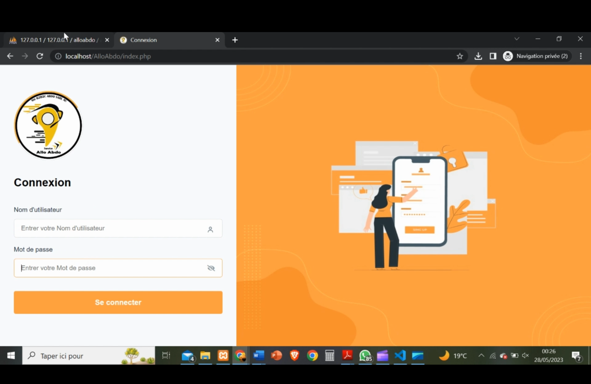

<div align="right"> <a href="./README.md">🇫🇷 Français</a> | <a href="./README.en.md">🇬🇧 English</a> </div>
<a name="top"></a>

<div align="center">
  
  
  
  
  
  <h1>Delivery Management Application — AlloAbdo (Final Year Internship)</h1> 
  <p>Project carried out during my final year internship at the Higher School of Technology (EST) Dakhla for <strong>AlloAbdo</strong> 
    — comprehensive delivery management + computer vision module for speed control.</p>
</div>

# [Demo Video](https://drive.google.com/file/d/1p6kfkWYCBZsjH0PLqSy-tZD9gWpFe-_K/view?usp=sharing)
If the link doesn't work, consider copying and pasting it into the search bar.

# [Report](https://drive.google.com/file/d/1GSlM0FEUHL_MSP6LQCMOSZoeCxvAJUSF/view?usp=sharing)
If the link doesn't work, consider copying and pasting it into the search bar.

## Table of Contents
1. [Introduction](#introduction)
2. [Key Features](#features)
3. [Technologies Used](#tech)
4. [Installation](#installation)
5. [Future Improvements](#future)
6. [Demo](#demo)

---

## Introduction<a name="introduction"></a>

I developed this project during my final year internship at EST Dakhla, completed at AlloAbdo, a company specialized in delivery services. 
The main objective was to design and deploy a delivery activity management application to improve operational tracking and financial health of the company, followed by adding a computer vision module to monitor delivery drivers' speed and track speeding vehicles.

The application aims to provide administrators with:

1. Secure authentication (passwords encrypted in database).

2. A comprehensive dashboard showing financial health (revenue per client), package evolution, and daily statistics.

3. CRUD tools for client and package management.

4. Invoice generation/printing with ability to add extra charges.

5. The computer vision module detects vehicles and motorcycles, extracts license plates, estimates speed, and logs speeding vehicles in a dedicated folder for traceability.

<div align="right">
  <a href="#top">⬆ Back to top</a>
</div>

---

## Key Features<a name="features"></a>

### 📊 Admin Dashboard
- Revenue per client and comparative analysis
- Package evolution visualization (daily/monthly statistics)
- Financial key performance indicators (KPIs)
- Secure authentication system (encrypted passwords)

### 🧾 Operations Management
- Complete client CRUD (Add/Edit/Delete)
- Real-time package status tracking
- Invoice printing with additional charges
- Complete transaction history

### 🚦 Road Safety Module
- Automatic vehicle speed detection
- License plate recognition
- Speeding cases logged in dedicated folder
- Violation report generation

### 📈 Reporting
- Data export (PDF/txt)


<div align="right">
  <a href="#top">⬆ Back to top</a>
</div>

---

## Technologies Used<a name="tech"></a>

<div align="center">
  
  
  
  
  
  
</div>

### Web Application
- **Frontend**: Bootstrap, JavaScript, HTML5/CSS3
- **Backend**: PHP 
- **Database**: MySQL 
- **Security**: Encryption, Protected sessions

### Computer Vision Module
- **Language**: Python 3.x
- **Libraries**: OpenCV, YOLO (Object Detection)
- **Image processing**: Contour detection, Optical Flow
- **Speed calculation**: Real-time video flow analysis
  

<div align="right">
  <a href="#top">⬆ Back to top</a>
</div>

---

## Installation<a name="installation"></a>

### Prerequisites
- XAMPP (Apache, MySQL, PHP)

### Installation Steps
1. **Clone the repository**
   ```bash
   git clone https://github.com/Alidou26/Stage_fin_Etude_ESTD.git
   cd Stage_fin_Etude_ESTD
   ```
   ### Configure the database
* Import `alloabdo.sql` into phpMyAdmin
* Configure access in `BaseDeDonnees.php`

### Start the server
* Launch Apache and MySQL via XAMPP
* Access `http://localhost/Stage_fin_Etude_ESTD`

<div align="right"> <a href="#top">⬆ Back to top</a> </div>

---

## Future Improvements<a name="future"></a>
* 📱 **Mobile application (React Native/Flutter)** for drivers (photo capture, delivery validation, signature)
* 🔐 **Enhanced security**: JWT, 2FA, session management, action auditing
* ☁️ **Cloud deployment (Azure/AWS) with CI/CD**
* 🤖 **Automatic alerts**: SMS/email for delayed packages or incidents
* 📈 **Forecasting/BI**: Analytical dashboard with volume predictions and route optimization
* 🧭 **CV module enhancement**: Upgrade to deep-learning model (YOLOv5/YOLOv8) for robust detection and more reliable LPR (ALPR)
* 🗂️ **Audit interface** to quickly review speeding cases (replay, metadata, export)

<div align="right"> <a href="#top">⬆ Back to top</a> </div>

---

## Demo<a name="demo"></a>
 

 

 

 

 

 

 

 

 

 

 

 

 


<div align="right"> <a href="#top">⬆ Back to top</a> </div>
